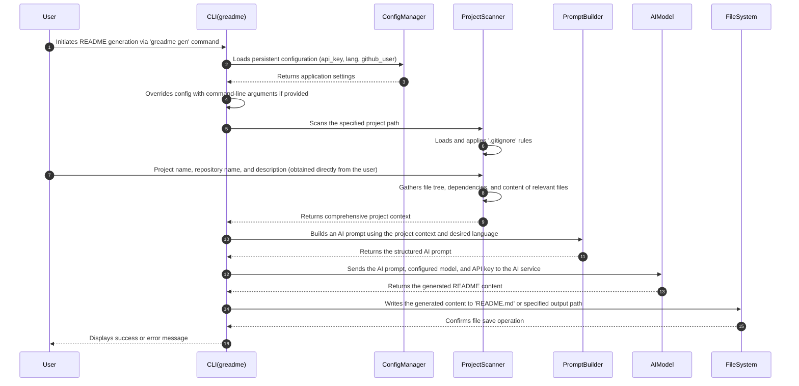

# README Generator

> CLI tool that reads your project structure, dependencies and source files, then writes the README for you, using AI models.

## Badges

[](https://github.com/vinifreitaspaulino/readme-generator)
[](https://github.com/vinifreitaspaulino/readme-generator/blob/main/LICENSE)
[](https://github.com/vinifreitaspaulino/readme-generator/commits/main)
[](https://github.com/vinifreitaspaulino/readme-generator)
[](https://pypi.org/project/greadme)
[](https://pypi.org/project/greadme)

## Table of Contents

- [README Generator](#readme-generator)
  - [Badges](#badges)
  - [Table of Contents](#table-of-contents)
  - [Overview](#overview)
    - [Project Demonstration](#project-demonstration)
  - [Key Features](#key-features)
  - [Technical Stack](#technical-stack)
  - [Architecture](#architecture)
    - [Directory Structure](#directory-structure)
    - [Data Flow](#data-flow)
    - [System Components](#system-components)
  - [Getting Started](#getting-started)
    - [Prerequisites](#prerequisites)
    - [Installation](#installation)
    - [Configuration](#configuration)
  - [Usage](#usage)
  - [Customization Options](#customization-options)
    - [Configuration File Options](#configuration-file-options)
    - [Command-Line Arguments (`greadme gen` subcommand)](#command-line-arguments-greadme-gen-subcommand)
  - [Author](#author)
  - [License](#license)

## Overview

The `README Generator` addresses the common challenge faced by developers in creating and maintaining detailed, accurate `README.md` files for their projects. Manually documenting a project's purpose, architecture, dependencies, and usage can be a time-consuming and often overlooked task. This tool automates the process by leveraging artificial intelligence to analyze a project's codebase and infer all necessary details, thereby enabling developers and open-source maintainers to quickly generate high-quality documentation.

At its core, the project operates by scanning a target directory to understand its structure, programming language, and dependencies. It then compiles this contextual information into a prompt, which is subsequently sent to a large language model (Google Gemini). The AI processes the prompt and generates a comprehensive `README.md` tailored to the project. The tool also incorporates configurable settings for the AI model, API keys, and output language, ensuring flexibility and ease of use.

The `README Generator` stands out by providing an intelligent, automated solution to documentation generation, significantly reducing the manual effort involved. Its ability to infer crucial project details directly from the source code, coupled with support for multiple output languages and integration with `.gitignore` rules, ensures that the generated documentation is not only rich in detail but also relevant and concise. This approach minimizes setup time and maximizes productivity for developers looking to present their projects professionally.

### Project Demonstration


## Key Features

*   **AI-Powered Generation**: Automatically generates detailed `README.md` files by leveraging a configured AI model (Google Gemini).
*   **Intelligent Project Scanning**: Detects project type, extracts file structure, identifies dependencies, and reads relevant source file content.
*   **Configurable Settings**: Supports persistent configuration for AI API keys, default README language (English/Portuguese), and GitHub username.
*   **Command-Line Interface**: Provides an intuitive CLI for initiating README generation and managing application settings.
*   **`.gitignore` Integration**: Respects `.gitignore` rules during project scanning to exclude irrelevant files and directories from analysis.
*   **Multilingual Output**: Generates `README.md` files in either English (`en`) or Portuguese (`pt`) based on user preference.

## Technical Stack

*   **Programming Language**: Python 3.11+
*   **Frameworks and Libraries**:
    *   `argparse` (Python standard library for command-line argument parsing)
    *   `pathlib` (Python standard library for object-oriented filesystem paths)
    *   `tomllib` (Python standard library for parsing TOML files, used for configuration)
    *   `json` (Python standard library for JSON data handling, used for Node.js dependency scanning)
    *   `xml.etree.ElementTree` (Python standard library for XML parsing, used for Java dependency scanning)
    *   Google Gemini API (For AI interaction)
*   **Data Persistence**: Local `.toml` configuration file (`config.toml`)
*   **Build and Deployment Tools**: Standard Python packaging and execution mechanisms.
*   **Other relevant technologies**: File system interaction for project scanning and output writing.

## Architecture

The `README Generator` is designed with a modular architecture, separating concerns into distinct components for project scanning, configuration management, AI prompting, and command-line interface handling.

### Directory Structure

```text
greadme/                 # Main application package
  cli.py                 # Command-Line Interface: entry point, argument parsing, orchestration
  config.py              # Configuration Manager: handles loading, saving, and managing application settings
  scanner.py             # Project Scanner: analyzes project directory, infers type, structure, dependencies
  builder.py             # Prompt Builder: constructs the AI prompt from scanned project context
  ai.py                  # AI Interface: communicates with the Google Gemini API
  templates/             # Templates for AI prompts
    en.md                # English prompt template
    pt.md                # Portuguese prompt template
```

### Data Flow

The following sequence diagram illustrates the primary data flow when generating a `README.md` file:



### System Components

*   **CLI Module (`greadme.cli`):** Serves as the primary entry point for the application. It handles command-line argument parsing using `argparse` and orchestrates the workflow by coordinating calls to other modules for scanning, configuration, and AI interaction. It defines the `gen` and `config` subcommands.
*   **Configuration Module (`greadme.config`):** Manages application-wide settings such as the Gemini API key, preferred language, and GitHub username. It loads default values, persists user-defined settings to a `config.toml` file (located in `~/.config/greadme/` or `%APPDATA%\greadme\`), and ensures settings are applied consistently.
*   **Scanner Module (`greadme.scanner`):** This is the intelligence gathering component. It recursively traverses a target project directory, identifies the project's primary language and type, extracts a hierarchical file structure, determines project dependencies by parsing common manifest files (`pyproject.toml`, `requirements.txt`, `package.json`, `Cargo.toml`, `pom.xml`, etc.), and reads the contents of key source files. It intelligently ignores common development artifacts and respects `.gitignore` rules.
*   **Builder Module (`greadme.builder`):** Responsible for transforming the structured project context obtained from the `Scanner` into a coherent and effective prompt for the AI model. This module likely uses templates (e.g., `en.md`, `pt.md`) to guide the AI in generating a well-structured and informative `README.md`.
*   **AI Module (`greadme.ai`):** Acts as the bridge between the application and the external AI service (Google Gemini). It encapsulates the logic for sending prompts, handling API requests, and return the AI responses.

## Getting Started

### Prerequisites
- Python 3.11+
- Google Gemini API key — get one at [Google AI Studio](https://aistudio.google.com)

### Installation

Install via pip:
```bash
pip install greadme
```

Or with pipx (recommended for global CLI usage):
```bash
pipx install greadme
```

### Configuration

Before generating your first README, you need to configure your API key and other preferences. Configuration settings are stored in a `config.toml` file, typically located at:
*   **Linux/macOS**: `~/.config/greadme/config.toml`
*   **Windows**: `%APPDATA%\greadme\config.toml`

You can manage these settings directly via the command-line interface:

*   **`ai.api_key`**: Your Google Gemini API key.
    *   Default: `""` (empty string, causing an error if not set)
    *   Example:
        ```bash
        greadme config set ai.api_key YOUR_GEMINI_API_KEY
        ```

*   **`ai.model`**: The specific Google Gemini model to use for generation.
    *   Default: `"gemini-2.5-flash"`
    *   Example:
        ```bash
        greadme config set ai.model gemini-2.0-flash-lite
        ```

*   **`general.lang`**: The default language for the generated README (`en` for English, `pt` for Portuguese).
    *   Default: `"en"`
    *   Example:
        ```bash
        greadme config set general.lang pt
        ```

*   **`general.github_user`**: Your GitHub username, used for generating relevant links and information in the README.
    *   Default: `""` (empty string, causing an error if not set for some features)
    *   Example:
        ```bash
        greadme config set general.github_user vinifreitaspaulino
        ```

To view your current configuration:
```bash
greadme config show
```

## Usage

The `README Generator` is primarily controlled via its command-line interface. Once installed and configured, you can generate READMEs for your projects or manage settings.

To generate a `README.md` for a project:

```bash
greadme gen <project_path> [--output <output_path>] [--lang <language>] [--verbose]
```
or without `gen`:
```bash
greadme <project_path> [--output <output_path>] [--lang <language>] [--verbose]
```

**Examples**:

1.  **Generate a README for the current directory using default settings (English, default AI model, configured API key, default output path)**:
    ```bash
    greadme .
    ```

2.  **Generate a README for a specific project path, outputting it in Portuguese**:
    ```bash
    greadme ~/my_python_project --lang pt
    ```

3.  **Generate a README for a project, saving it to a custom location and enabling verbose output**:
    ```bash
    greadme /path/to/the/project --output /path/to/output/folder --verbose
    ```

4.  **Override the API key and AI model directly for a single generation command**:
    ```bash
    greadme . --api-key ANOTHER_KEY --model gemini-3-flash-preview
    ```

## Customization Options

The `README Generator` offers several options for customizing its behavior, both through persistent configuration and command-line arguments.

### Configuration File Options

These options are stored in the `config.toml` file and affect all subsequent `greadme` commands unless overridden by command-line arguments.

| Key                 | Type   | Default            | Description                                                                                                                                                                                                                                                                       |
| :------------------ | :----- | :----------------- | :-------------------------------------------------------------------------------------------------------------------------------------------------------------------------------------------------------------------------------------------------------------------------------- |
| `general.lang`      | String | `"en"`             | Sets the default language for generated `README.md` files. Supported values are `"en"` (English) and `"pt"` (Portuguese).                                                                                                                                                            |
| `general.github_user` | String | `""`               | Your GitHub username. This is used by the AI to infer author details and construct GitHub-related links within the README. Essential for the badge links.                                                                                              |
| `ai.api_key`        | String | `""`               | Your API key for accessing the Google Gemini AI service. This is mandatory for the tool to function and generate READMEs.                                                                                                                                                             |
| `ai.model`          | String | `"gemini-2.5-flash"` | Specifies the particular Google Gemini model to be used for AI generation. Different models may offer varying performance, cost, and output quality.                                                                                                                                  |

**Example `config.toml` snippet:**

```toml
[general]
lang = "en"
github_user = "vinifreitaspaulino"

[ai]
api_key = "YOUR_GEMINI_API_KEY_HERE"
model = "gemini-2.5-flash"
```

### Command-Line Arguments (`greadme gen` subcommand)

These arguments allow for temporary overrides of configured settings or provide specific parameters for a single `gen` operation. You can also omit `gen` and pass the path, this is also understood as generating a README.

| Argument          | Type   | Default (or config)    | Description                                                                                                                                                                            |
| :---------------- | :----- | :--------------------- | :------------------------------------------------------------------------------------------------------------------------------------------------------------------------------------- |
| `path`            | Path   | *Required*             | The filesystem path to the project directory for which the README should be generated.                                                                                                  |
| `--output`, `-o`  | Path   | `<project_path>/README.md` | Specifies the full output path, including the filename, for the generated `README.md`. If not provided, it defaults to `README.md` in the project root.                                  |
| `--verbose`, `-v` | Flag   | `False`                | Activates verbose logging, displaying detailed progress messages during the scanning, prompt building, and AI call phases.                                                                 |
| `--lang`, `-l`    | String | `config["general"]["lang"]` | Overrides the default language for the generated README for this specific run. Choices are `"pt"` (Portuguese) or `"en"` (English).                                                    |
| `--api-key`       | String | `config["ai"]["api_key"]` | Temporarily overrides the `ai.api_key` configured in `config.toml` for the current generation command. Useful for testing or managing multiple keys.                                 |
| `--model`         | String | `config["ai"]["model"]` | Temporarily overrides the `ai.model` configured in `config.toml` for the current generation command. Allows for on-the-fly switching between AI models.                                |
| `--github_user`   | String | `config["general"]["github_user"]` | Temporarily overrides the `general.github_user` configured in `config.toml` for the current generation command.                                                                      |

These options collectively provide fine-grained control over how `README Generator` operates, allowing users to tailor the generation process to their specific needs and project contexts.

## Author

**Vinicius de Freitas Paulino**
- **GitHub:** [@vinifreitaspaulino](https://github.com/vinifreitaspaulino)

## License

This project is licensed under the MIT License.